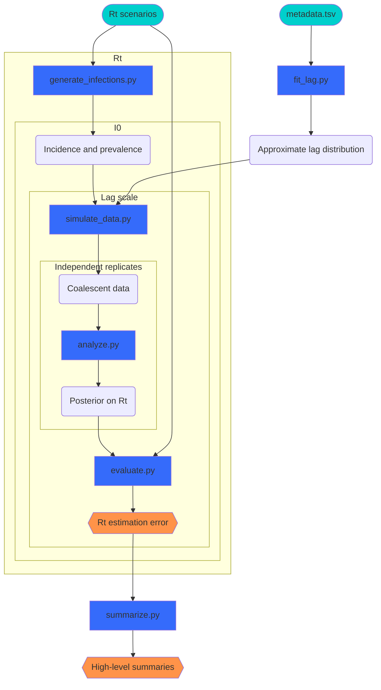

# cfa-genomic-lag-effect

⚠️ This is a work in progress ⚠️

This repo contains code to study via simulations the effect of lag (from sample collection to sequence availability) on the utility of genomic data for estimating epidemiological parameters.
It consists of a small python package, `lag`, and some associated utilities in `/scripts`.

## Getting started

This is a [poetry](https://python-poetry.org/) project with a split codebase.
The more general (and generalizable) modeling code is in the python package `lag`.
The simulation study also uses more special-purpose code (e.g., for approximating observed distributions of reporting lags), which live as callable python scripts in `pipeline/`.
The package all dependencies required to run the simulations can be installed with `poetry install`.

## Simulation study

The simulations are designed to examine how longer and shorter average lag (the reporting delay between a sample being collected and the sequence being available for analysis) impacts the utility of genomic data for real-time epidemiological inference.

The inference target is $R\_t$, with the link between $R\_t$ and genomic data given by a renewal coalescent model.
The distribution of lags is based on those observed in genomic data for SARS-CoV-2, with shorter hypothetical distributions obtained by scale transformations of a [spline-based approximation](https://www.sciencedirect.com/science/article/pii/S0377042724003807) to the empirical probability density function $\hat{f}$.
Coalescent models are informed by the times of common ancestry of the genomic sequences, and the distribution of these times is sensitive to incidence, prevalence, and trends therein (and thus $R\_t$).
To account for some measure of these effects, simulations are performed for several $R\_t$ trajectories as well as several magnitudes of initial incidence $I\_0$.

The following diagram describes the simulation study pipeline, with nested plates showing how the grid of true $R\_t$, $I\_0$, and lag scaling factors is handled.
Note that all python scripts have settings configurable via `pipeline/config.json`, including to define the grid of true parameter values.
Inputs are teal, pipeline scripts blue, results orange, and all other elements are intermediate inputs/outputs.

### Running the pipeline

The pipeline is implemented in [snakemake](https://snakemake.github.io/), which will also be installed with `poetry install`.
The pipeline requires two inputs:
- Nextstrain's open [metadata.tsv](https://docs.nextstrain.org/projects/ncov/en/latest/reference/remote_inputs.html) for SARS-CoV-2, as `pipeline/input/metadata.tsv`
- $R\_t$ time series, taken to be values of a weekly piecewise-constant function, in `pipeline/input/rt`, as plain text with one line per week (forward in time).

Running `poetry run sh pipeline/setup.sh` will result in the requisite Nextstrain data being downloaded and uncompressed as well as the generation of three suitable $R\_t$ time series.

With these inputs in place, run the pipeline via `poetry run snakemake -j1` (this flag keeps snakemake from conflicting with NumPyro and polars on core and memory usage).

### Visualizing the simulated scenarios

The command `poetry run snakemake diagnostics` will produce plots showing:
- The 3 $R_t$ scenarios (in `pipeline/output/rt/`).
- The 9 pairs of incidence and prevalence curves resulting from each $R_t$ scenario and initial incident infection count (in `pipeline/output/infections/`).
- The scaled lag distributions (in `pipeline/output/lag/`) each a multi-panel plot showing
  - The probability density function (minus the long upper 5\% tail).
  - The cumulative distribution function (for the entire distribution).
  - A comparison of the approximating distribution to the samples on which it was fit.
  - A comparison of samples of the approximation to the approximation itself.

Note that if snakemake has not yet been called, this will run pipeline steps prior to `analyze.py`.

## Project Admin

Andy Magee, PhD, (@afmagee42)

------------------------------------------------------------------------------------

## Disclaimers

### General Disclaimer

This repository was created for use by CDC programs to collaborate on public health related projects in support of the [CDC mission](https://www.cdc.gov/about/organization/mission.htm). GitHub is not hosted by the CDC, but is a third party website used by CDC and its partners to share information and collaborate on software. CDC use of GitHub does not imply an endorsement of any one particular service, product, or enterprise.

### Public Domain Standard Notice

This repository constitutes a work of the United States Government and is not
subject to domestic copyright protection under 17 USC § 105. This repository is in
the public domain within the United States, and copyright and related rights in
the work worldwide are waived through the [CC0 1.0 Universal public domain dedication](https://creativecommons.org/publicdomain/zero/1.0/).
All contributions to this repository will be released under the CC0 dedication. By
submitting a pull request you are agreeing to comply with this waiver of
copyright interest.

### License Standard Notice

This repository is licensed under ASL v2 or later.

This source code in this repository is free: you can redistribute it and/or modify it under
the terms of the Apache Software License version 2, or (at your option) any
later version.

This source code in this repository is distributed in the hope that it will be useful, but WITHOUT ANY
WARRANTY; without even the implied warranty of MERCHANTABILITY or FITNESS FOR A
PARTICULAR PURPOSE. See the Apache Software License for more details.

You should have received a copy of the Apache Software License along with this
program. If not, see http://www.apache.org/licenses/LICENSE-2.0.html

The source code forked from other open source projects will inherit its license.

### Privacy Standard Notice

This repository contains only non-sensitive, publicly available data and
information. All material and community participation is covered by the
[Disclaimer](https://github.com/CDCgov/template/blob/master/DISCLAIMER.md)
and [Code of Conduct](https://github.com/CDCgov/template/blob/master/code-of-conduct.md).
For more information about CDC's privacy policy, please visit [http://www.cdc.gov/other/privacy.html](https://www.cdc.gov/other/privacy.html).

### Contributing Standard Notice

Anyone is encouraged to contribute to the repository by [forking](https://help.github.com/articles/fork-a-repo)
and submitting a pull request. (If you are new to GitHub, you might start with a
[basic tutorial](https://help.github.com/articles/set-up-git).) By contributing
to this project, you grant a world-wide, royalty-free, perpetual, irrevocable,
non-exclusive, transferable license to all users under the terms of the
[Apache Software License v2](http://www.apache.org/licenses/LICENSE-2.0.html) or
later.

All comments, messages, pull requests, and other submissions received through
CDC including this GitHub page may be subject to applicable federal law, including but not limited to the Federal Records Act, and may be archived. Learn more at [http://www.cdc.gov/other/privacy.html](http://www.cdc.gov/other/privacy.html).

### Records Management Standard Notice

This repository is not a source of government records but is a copy to increase
collaboration and collaborative potential. All government records will be
published through the [CDC web site](http://www.cdc.gov).
