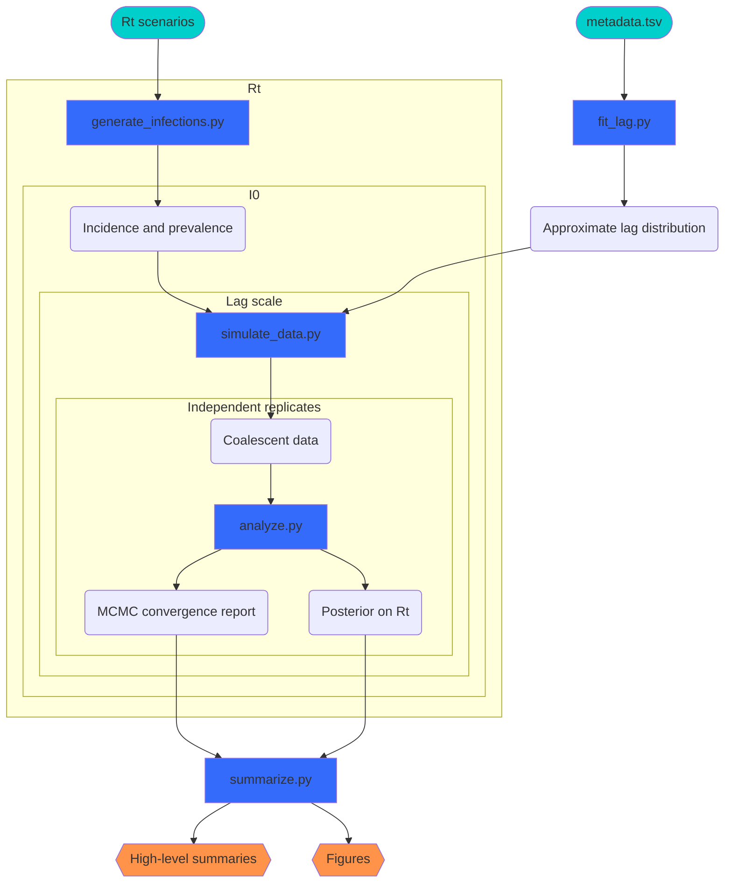

# Simulation study pipeline

The simulations are designed to examine how longer and shorter average lag (the reporting delay between a sample being collected and the sequence being available for analysis) impacts the utility of genomic data for real-time epidemiological inference.

The inference target is $R_t$, with the link between $R_t$ and genomic data given by a renewal coalescent model.
The distribution of lags is based on those observed in genomic data for SARS-CoV-2, with shorter hypothetical distributions obtained by scale transformations of a [spline-based approximation](https://www.sciencedirect.com/science/article/pii/S0377042724003807) to the empirical probability density function $\hat{f}$.
Coalescent models are informed by the times of common ancestry of the genomic sequences, and the distribution of these times is sensitive to incidence, prevalence, and trends therein (and thus $R_t$).
To account for some measure of these effects, simulations are performed for several $R_t$ trajectories as well as several magnitudes of initial incidence $I_0$.

The following diagram describes the simulation study pipeline, with nested plates showing how the grid of true $R_t$, $I_0$, and lag scaling factors is handled.
Note that all python scripts have settings configurable via `pipeline/config.json`, including to define the grid of true parameter values.
Inputs are teal, pipeline scripts blue, results orange, and all other elements are intermediate inputs/outputs.

## Running the pipeline

The pipeline is implemented in [snakemake](https://snakemake.github.io/), which will also be installed with `poetry install`.
The pipeline requires two inputs:

- Nextstrain's open [metadata.tsv](https://docs.nextstrain.org/projects/ncov/en/latest/reference/remote_inputs.html) for SARS-CoV-2, as `pipeline/input/metadata.tsv`
- $R_t$ time series, taken to be values of a weekly piecewise-constant function, in `pipeline/input/rt`, as plain text with one line per week (forward in time).

Running `poetry run sh pipeline/setup.sh` will result in the requisite Nextstrain data being downloaded and uncompressed as well as the generation of three suitable $R_t$ time series.

With these inputs in place, run the pipeline via `poetry run snakemake -j1` (this flag keeps snakemake from conflicting with NumPyro and polars on core and memory usage).

### Visualizing the simulated scenarios

The command `poetry run snakemake diagnostics` will produce plots showing:

- The 3 $R_t$ scenarios (in `pipeline/output/rt/`).
- The 9 pairs of incidence and prevalence curves resulting from each $R_t$ scenario and initial incident infection count (in `pipeline/output/infections/`).
- The scaled lag distributions (in `pipeline/output/lag/`) each a multi-panel plot showing
  - The probability density function (minus the long upper 5% tail).
  - The cumulative distribution function (for the entire distribution).
  - A comparison of the approximating distribution to the samples on which it was fit.
  - A comparison of samples of the approximation to the approximation itself.

Note that if snakemake has not yet been called, this will run pipeline steps prior to `analyze.py`.

## Re-configuring the pipeline

The [pipeline config file](../pipeline/config.json) allows a number of parameters to be changed.
Some changes can be made safely, while others may have unintended downstream consequences.
For example, changing the per-week-day profile for sampling times should be safe, but adding a much larger $I_0$ could lead to an overly-large number of implausibly old coalescent events.
Parameter values have been chosen to cover a reasonable range of parameter space and for cross-compatibility.
The [diagnostic plots](#visualizing-the-simulated-scenarios) are intended to help check the sanity of settings, but cannot catch every possible problem.

### Configurable settings
- `seed`: the prefix for the seed (the actual seed is created from this so as to be unique per combination of $R_t$, $I_0$, lag scaling factor, and simulation replicate)
- `empirical_lag`
  - `date_lower`: Nextstrain data before this date is ignored when determining the empirical lag distribution
  - `date_upper`: Nextstrain data on or after this date is ignored when determining the empirical lag distribution
  - `n_steps`: controls knot count in the spline approximation to the empirical lag distribution
  - `low`: lags less than `low` have 0 probability, regardless of the empirical distribution
  - `high`: lags larger than `high` have 0 probability, regardless of the empirical distribution
  - `scaling_factors`: if $X \sim \hat{f}(X)$ is drawn from the fitted approximate lag distribution, simulations will use $Y := kX$ for k in `scaling_factors`
- `simulations`
  - `sampling`: controls coalescent sampling (tip times)
    - `weekday_effect`: provides the per-week-day proportion of samples taken in a week
    - `n_samples`: number of samples taken
    - `n_sampled_weeks`: samples will be taken over this many weeks
  - `n_rep`: number of replicate simulations per combination of $R_t$, $I_0$, lag scaling factor
  - `i0`: a vector of initial incidence values
- `renewal`
  - `infectious_profile` the infectiousness profile of the [renewal model](model.md#1)
  - `init_growth_steps` number of days incidence evaluated at prior to first time step in the renewal model (should be at least equal to length of `infectious_profile`)
- `bayes`
  - `mcmc`: settings passed to `numpyro.infer.NUTS`
  - `mcmc`: settings passed to `umpyro.infer.MCMC`
  - `ci_alpha`: where credible intervals are used, they will span (1 - `ci_alpha`) x 100\%
  - `cores`: number of cores available to `NumPyro` for parallel chains
  - `convergence_report_all`: whether to report MCMC convergence summaries for all parameters (`true`) or just those failing convergence standards (`false`)
